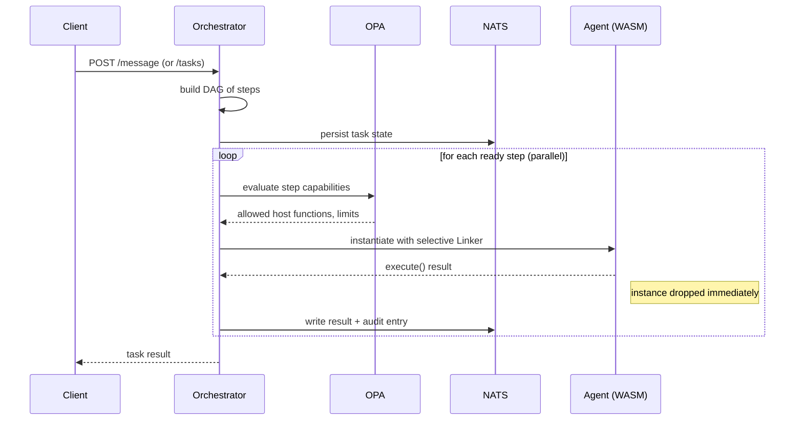

# WASM_AF — WebAssembly Agent Framework

**A security-first AI agent orchestration framework built on the [WebAssembly Component Model](https://component-model.bytecodealliance.org/) and [wasmtime](https://wasmtime.dev/).**

WASM_AF leverages the sandboxed, ephemeral nature of WebAssembly to create a zero-trust AI agent runtime. Agents are WASM components that are isolated by default, granted capabilities by policy, and destroyed when their work is done.

[](http://jolucas1.nvidia.com:4000/a/y7XzQyKOlKWvOdI3)

---

## Quick Start

```bash
export NV_API_KEY="nvapi-..."
cd examples/wasmclaw
LLM_MODE=api make reply-all-demo
```

Prerequisites: [Rust](https://rustup.rs/) (with `wasm32-wasip2` target), [NATS server](https://nats.io/) (or [wash](https://wasmcloud.com/docs/installation/) which bundles one), [jq](https://jqlang.github.io/jq/).

For API inference, set `NV_API_KEY` in a `.env` file at the repo root (gitignored) or export it in your shell.

---

## Why WASM + AI Agents?

Most agent frameworks enforce security through **convention**: configure your tools carefully, don't pass credentials to agents that don't need them, restrict network access through application-level checks. This WebAssembly framework enforces security through **construction**. A WASM component **cannot** touch the filesystem, network, or environment unless explicitly granted access by the orchestrator.

---

## Architecture



The orchestrator is a single Rust binary that embeds the [wasmtime](https://wasmtime.dev/) Component Model runtime. For each task step, it composes a `Linker` with only the host interfaces OPA permits, instantiates the agent component, calls its `execute` export, reads the result, and drops the instance.

**Structural capability absence**: If OPA doesn't permit `host-exec` for a step, that interface isn't added to the Linker. The component fails to instantiate — the capability is structurally absent, not just denied at runtime.

NATS JetStream KV provides task state persistence and an immutable audit trail.

---

## Core Principles

**Policy-driven capability grants.** [Open Policy Agent (OPA)](https://www.openpolicyagent.org/) evaluates capability grants and gates every step of execution. Structured decisions from Rego (`allowed_hosts`, `max_memory_pages`, `timeout_sec`, `host_functions`, `config`, `allowed_paths`, `requires_approval`) control which WIT interfaces are linked into each component instance. Deny-by-default; the orchestrator won't start without `OPA_POLICY`.

**Per-instance scoping.** Each component gets its own `Linker` and `Store`. When multiple url-fetch instances run in parallel, each is scoped to exactly one domain.

**No inter-agent communication.** Agents do not talk to each other. The orchestrator mediates all data flow, stores intermediate results in NATS KV, and passes context from ancestor steps to their dependents.

**WIT-typed host interfaces.** LLM inference, shell execution, email delivery, and KV storage are WIT interfaces linked into components that need them. A component that doesn't import `host-llm` cannot call it — the import doesn't exist in its world. Credentials (API keys, SMTP) live in Rust closures; they never enter WASM memory.

**Ephemeral lifecycle.** Each component is instantiate → `call_execute` → drop within a single function scope. An agent or runtime that doesn't exist can't be exploited. The underlying compiled `Component` is cached in memory after the first load, so instantiation is near-zero cost on subsequent invocations — disk I/O and JIT compilation happen once per process lifetime.

**Bring your own agent.** External WASM components can be uploaded to a running orchestrator via `POST /agents`. They are validated against the WIT world definition, stored on disk, and registered with `capability: "untrusted"`. The BYOA Rego policy tier (`policies/byoa.rego`) applies strict sandbox defaults — no host functions, no network, 4 MiB memory, 10s timeout, mandatory approval.

**Human-in-the-loop approval gates.** When OPA policy returns `requires_approval: true` for a step, the orchestrator pauses that step instead of executing it. Other branches of the DAG continue running. Execution resumes only after an explicit approve or reject via the HTTP API.

```rego
# In your policy.rego — approval is opt-in per agent type:
requires_approval if { input.step.agent_type == "email-send" }
approval_reason := "email delivery requires human approval" if { input.step.agent_type == "email-send" }
```

---

## API

### Task Lifecycle

| Method | Path | Description |
|---|---|---|
| `POST` | `/message` | Synchronous chat endpoint (submit + poll + return response) |
| `POST` | `/tasks` | Submit a new task (returns `task_id`) |
| `GET` | `/tasks/{id}` | Get task state (plan, step statuses, results) |

### Approval Gates

| Method | Path | Description |
|---|---|---|
| `GET` | `/tasks/{id}/approvals` | List steps awaiting approval |
| `POST` | `/tasks/{id}/steps/{stepId}/approve` | Approve a step (body: `{"approved_by": "alice"}`) |
| `POST` | `/tasks/{id}/steps/{stepId}/reject` | Reject a step (body: `{"rejected_by": "bob", "reason": "..."}`) |

### Bring Your Own Agent (BYOA)

| Method | Path | Description |
|---|---|---|
| `POST` | `/agents` | Upload a `.wasm` component + metadata (multipart form) |
| `DELETE` | `/agents/{name}` | Remove an external agent (platform agents are protected) |
| `GET` | `/agents` | List all agents (includes `external` flag) |

External agents are registered at runtime and automatically receive `capability: "untrusted"` with zero host functions.

```bash
curl -X POST localhost:8080/agents \
  -F 'meta={"name":"my-agent","context_key":"my_agent_result"}' \
  -F 'wasm=@my_agent.wasm'

curl localhost:8080/agents | jq .
curl -X DELETE localhost:8080/agents/my-agent
```

See [docs/creating-an-agent.md](docs/creating-an-agent.md) for the full guide.

---

## Project Structure

```
wasm_af/
├── Cargo.toml                      # Rust workspace (orchestrator crates)
├── Makefile                        # build, test, demo
│
├── wit/
│   └── agent.wit                   # WIT interface definitions (the agent contract)
│
├── crates/
│   ├── orchestrator/               # the framework — Rust binary (axum + wasmtime)
│   │   ├── src/
│   │   │   ├── main.rs             # HTTP server, env config, startup
│   │   │   ├── engine.rs           # wasmtime Component loading, selective Linker
│   │   │   ├── host/mod.rs         # WIT Host trait impls (llm, kv, exec, etc.)
│   │   │   ├── policy.rs           # OPA evaluator (regorus, evaluates Rego per step)
│   │   │   ├── scheduler.rs        # DAG scheduler, parallel dispatch, splice
│   │   │   ├── registry.rs         # agent registry (thread-safe, mutable at runtime)
│   │   │   └── api.rs              # HTTP handlers (message, submit, get, approve, reject, BYOA)
│   │   └── Cargo.toml
│   │
│   ├── dag/                        # DAG: dependency graph, ready-set, ancestors, splice
│   │   └── src/lib.rs
│   │
│   └── taskstate/                  # NATS JetStream KV: task state, audit log, payloads
│       └── src/lib.rs
│
├── policies/                       # reusable OPA policy modules
│   └── byoa.rego                   # untrusted-agent sandbox tier
│
├── runtimes/                       # WASI sandbox runtimes (downloaded, not checked in)
│   ├── build.sh                    # downloads Python WASM (SHA256-verified)
│   └── python.wasm                 # CPython 3.12 for wasm32-wasi (gitignored)
│
├── components/                     # Rust workspace — WASM agent components (wit-bindgen)
│   ├── .cargo/config.toml          # default target: wasm32-wasip2
│   └── agents/
│       ├── router/                 # LLM-based skill router (classifies → skill + params)
│       ├── shell/                  # host command execution via host-exec
│       ├── sandbox-exec/           # sandboxed code execution via host-sandbox
│       ├── file-ops/               # WASI std::fs (no host functions)
│       ├── email-send/             # host fn email delivery via host-email
│       ├── email-read/             # config-injected inbox reader via host-config
│       ├── memory/                 # conversation history via host-kv
│       ├── responder/              # LLM response generation via host-llm
│       ├── url-fetch/              # URL fetching via wasi:http
│       ├── web-search/             # Brave Search API via wasi:http
│       └── summarizer/             # LLM summarization via host-llm
│
└── examples/
    ├── pii-pipeline/              # BYOA demo: Python agent in a multi-agent pipeline
    ├── prompt-injection/           # security demo: injection fails structurally
    └── wasmclaw/                   # personal AI assistant with two-tier execution
        ├── lib/setup.sh            # shared infra: build, NATS, orchestrator, cleanup
        ├── run.sh                  # main demo (skills, security, approval gate)
        ├── reply-all-demo.sh       # parallel DAG demo (jailbreak + approval)
        ├── agents.json             # agent registry
        ├── policy.rego             # step policy
        ├── submit.rego             # submission policy
        ├── data.json               # allowlists, feature flags, jailbreak patterns
        ├── *_test.rego             # 80 OPA tests (opa test .)
        └── Makefile
```

---

## Running the Demos

### Wasmclaw (Personal AI Assistant)

```bash
cd examples/wasmclaw
make demo                              # mock LLM (deterministic, no deps)
LLM_MODE=api make demo                 # NVIDIA NIM API (needs NV_API_KEY)
make reply-all-demo                    # parallel DAG: jailbreak + approval (interactive Y/n)
```

### PII Pipeline (Bring Your Own Agent)

```bash
cd examples/pii-pipeline
make demo                              # mock LLM (deterministic, no deps)
LLM_MODE=api make demo                 # NVIDIA NIM API (needs NV_API_KEY)
```

### Prompt Injection

```bash
cd examples/prompt-injection && make demo    # requires Ollama (pulls model automatically)
```

---

## Configuration

### Orchestrator

| Variable | Default | Description |
|---|---|---|
| `LISTEN_ADDR` | `:8080` | HTTP server listen address |
| `WASM_DIR` | `./components/target/wasm32-wasip2/release` | Directory containing compiled `.wasm` components |
| `NATS_URL` | `nats://127.0.0.1:4222` | NATS server address |
| `OPA_POLICY` | — | Path to `.rego` file or directory (**required**) |
| `OPA_DATA` | — | Path to a JSON data file (populates OPA data store at startup) |
| `AGENT_REGISTRY_FILE` | — | Path to JSON agent registry file (required) |
| `AGENT_REGISTRY` | — | Inline JSON agent registry (takes precedence over file) |
| `LLM_MODE` | `mock` | `mock` for deterministic routing, `api` for remote inference (NVIDIA NIM, etc.), `real` for local Ollama |
| `LLM_BASE_URL` | — | OpenAI-compatible API base URL |
| `LLM_API_KEY` | — | API key for the LLM endpoint (required when `LLM_MODE=api`) |
| `LLM_MODEL` | `gpt-4o-mini` | Model name for the LLM endpoint |
| `LLM_TEMPERATURE` | — | Default sampling temperature |
| `LLM_TIMEOUT_SEC` | `120` | HTTP client timeout for LLM API calls |
| `PLUGIN_TIMEOUT_SEC` | `30` | Max wall-clock seconds per component invocation |
| `PLUGIN_MAX_MEMORY_PAGES` | `256` | Max WASM memory pages per component (64 KiB each) |
| `SHELL_ALLOWED_COMMANDS` | `ls,cat,pwd,...` | Comma-separated command binary allowlist |
| `SHELL_ALLOWED_PATHS` | `/tmp/wasmclaw` | Comma-separated path bases for shell argument confinement |
| `SHELL_TIMEOUT_SEC` | `10` | Max wall-clock seconds per shell command execution |
| `SANDBOX_RUNTIMES_DIR` | `./runtimes` | Directory containing WASI runtime `.wasm` files |
| `SANDBOX_TIMEOUT_SEC` | `30` | Max wall-clock seconds per sandboxed code execution |
| `SANDBOX_ALLOWED_LANGUAGES` | `python` | Comma-separated language allowlist for sandbox-exec |
| `SANDBOX_ALLOWED_PATHS` | `/tmp/wasmclaw` | Comma-separated host paths mounted into sandbox instances |
| `EMAIL_ALLOWED_DOMAINS` | `example.com,partner-corp.com` | Comma-separated recipient domain allowlist |
| `APPROVAL_WEBHOOK_URL` | — | URL to POST approval events |
| `APPROVAL_TIMEOUT_SEC` | `0` | Auto-reject steps after N seconds (0 = no timeout) |

### NVIDIA NIM API

| Variable | Maps to | Default |
|---|---|---|
| `NV_API_KEY` | `LLM_API_KEY` | — |
| `NV_MODEL` | `LLM_MODEL` | `nvdev/nvidia/llama-3.3-nemotron-super-49b-v1` |

---

## WIT Interface Definition

The agent contract is defined in `wit/agent.wit`. Every agent component implements the `execute` export and may import any subset of the host interfaces:

| Interface | Functions | Purpose |
|---|---|---|
| `host-llm` | `llm-complete` | LLM inference (credentials in host closure) |
| `host-kv` | `kv-get`, `kv-put` | NATS JetStream KV (per-agent-type namespace) |
| `host-exec` | `exec-command` | Host command execution (allowlist-gated) |
| `host-sandbox` | `sandbox-exec` | Sandboxed code execution (WASI runtime) |
| `host-email` | `send-email` | Email delivery (domain allowlist) |
| `host-config` | `get-config` | Read-only config (always available) |

Agents import only the interfaces they need. The orchestrator's `Linker` provides only what OPA permits. Mismatch = instantiation failure = structural denial.

---

## License

Apache License 2.0 — see [LICENSE](LICENSE).
