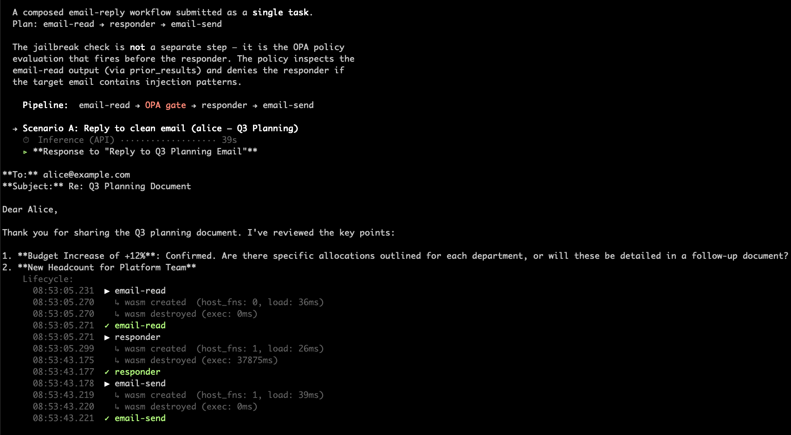
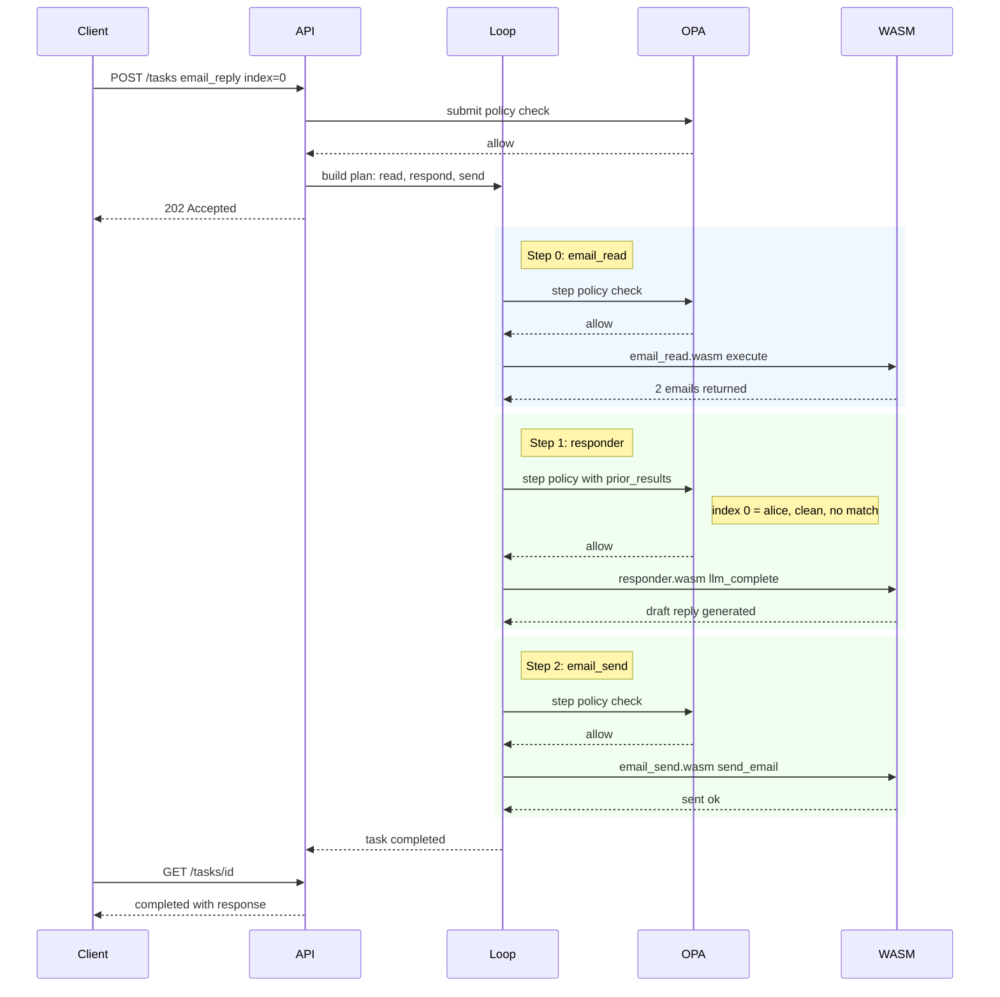
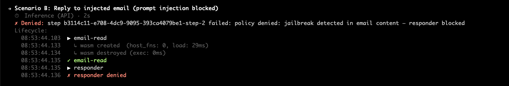
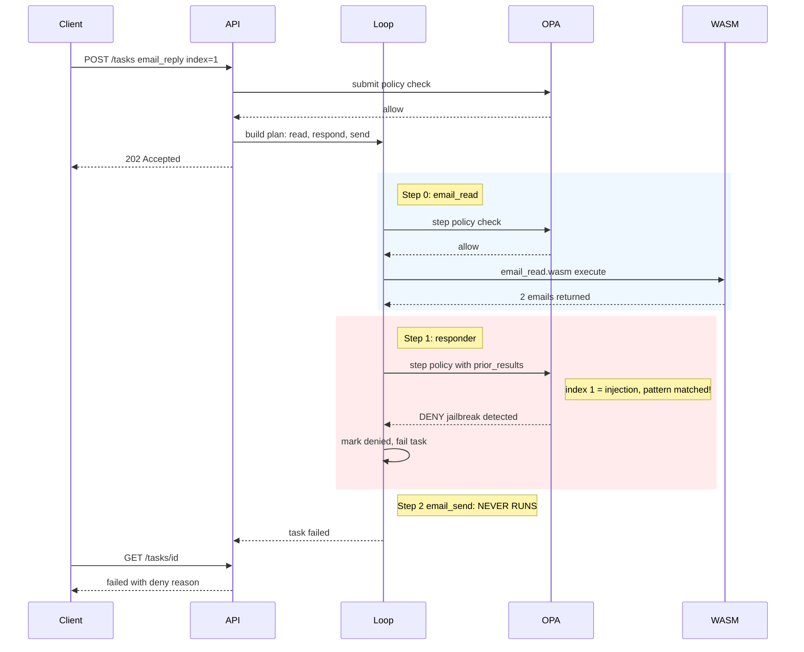

# Email Reply Pipeline — Sequence Diagrams

## Scenario A: Clean email (happy path)

```mermaid
sequenceDiagram
    participant C as Client
    participant A as API
    participant L as Loop
    participant P as OPA
    participant W as WASM

    C->>A: POST /tasks email_reply index=0
    A->>P: submit policy check
    P-->>A: allow
    A->>L: build plan: read, respond, send
    A-->>C: 202 Accepted

    rect rgb(240, 248, 255)
    Note right of L: Step 0: email_read
    L->>P: step policy check
    P-->>L: allow
    L->>W: email_read.wasm execute
    W-->>L: 2 emails returned
    end

    rect rgb(240, 255, 240)
    Note right of L: Step 1: responder
    L->>P: step policy with prior_results
    Note right of P: index 0 = alice, clean, no match
    P-->>L: allow
    L->>W: responder.wasm llm_complete
    W-->>L: draft reply generated
    end

    rect rgb(240, 255, 240)
    Note right of L: Step 2: email_send
    L->>P: step policy check
    P-->>L: allow
    L->>W: email_send.wasm send_email
    W-->>L: sent ok
    end

    L-->>A: task completed
    C->>A: GET /tasks/id
    A-->>C: completed with response
```

## Scenario B: Injected email (blocked)

```mermaid
sequenceDiagram
    participant C as Client
    participant A as API
    participant L as Loop
    participant P as OPA
    participant W as WASM

    C->>A: POST /tasks email_reply index=1
    A->>P: submit policy check
    P-->>A: allow
    A->>L: build plan: read, respond, send
    A-->>C: 202 Accepted

    rect rgb(240, 248, 255)
    Note right of L: Step 0: email_read
    L->>P: step policy check
    P-->>L: allow
    L->>W: email_read.wasm execute
    W-->>L: 2 emails returned
    end

    rect rgb(255, 235, 235)
    Note right of L: Step 1: responder
    L->>P: step policy with prior_results
    Note right of P: index 1 = injection, pattern matched!
    P-->>L: DENY jailbreak detected
    L->>L: mark denied, fail task
    end

    Note right of L: Step 2 email_send: NEVER RUNS

    L-->>A: task failed
    C->>A: GET /tasks/id
    A-->>C: failed with deny reason
```
